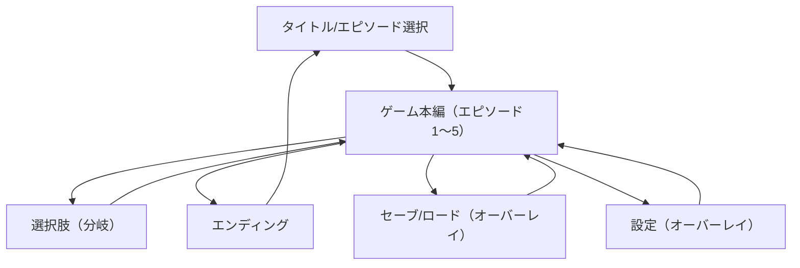

## 1. Product Overview

披露宴で上映・体験できる、TyranoScript(Web)製の全5エピソード構成ノベルゲーム。
新郎新婦（または司会者）の進行に合わせて、短時間・直感操作で分岐とエンディングを楽しめる。

## 2. Core Features

### 2.1 User Roles

| Role       | Registration Method | Core Permissions                         |
| ---------- | ------------------- | ---------------------------------------- |
| ゲスト（プレイヤー） | なし（ブラウザ起動）          | エピソードを再生し選択肢で分岐、セーブ/ロード、設定変更             |
| 進行係（司会/運営） | なし（同一UI）            | エピソード選択、早送り/スキップ制御、フルスクリーン切替、最初から/データ初期化 |

### 2.2 Feature Module

必要ページは最小限で、ゲーム内UI（メニュー/セーブ/設定）をオーバーレイとして提供する。

1. **タイトル/エピソード選択**：開始、エピソード一覧（1〜5）、既読/解放状態、各種設定、注意事項（音量/操作）。
2. **ゲーム本編（共通）**：テキスト表示、立ち絵/背景、選択肢による分岐、既読管理、バックログ、オート/スキップ、セーブ/ロード、エンディング表示。

### 2.3 Page Details

| Page Name    | Module Name | Feature description                          |
| ------------ | ----------- | -------------------------------------------- |
| タイトル/エピソード選択 | ヒーロー/開始導線   | ゲームタイトル、開始ボタン、フルスクリーン誘導を表示する。                |
| タイトル/エピソード選択 | エピソード一覧     | 1〜5のエピソードを表示し、解放/既読状態に応じて開始可否を制御する。          |
| タイトル/エピソード選択 | 設定/運営メニュー   | BGM/SE/ボイス音量、文字速度、オート速度、スキップ設定、データ初期化を操作できる。 |
| ゲーム本編（共通）    | ノベル表示UI     | 背景・立ち絵・名前枠・メッセージウィンドウを表示し、クリック/キーで進行する。      |
| ゲーム本編（共通）    | 選択肢（分岐）     | 選択肢を表示し、選択結果を変数に保存して次のシーン/エンディングへ遷移する。       |
| ゲーム本編（共通）    | クイックメニュー    | セーブ/ロード、バックログ、オート、スキップ、タイトルへ戻るをオーバーレイで提供する。  |
| ゲーム本編（共通）    | 既読/セーブデータ   | 既読フラグとセーブスロット（例: 20枠）を保持し、再開できる。             |
| ゲーム本編（共通）    | エンディング表示    | 分岐結果に応じたエンディング（例: 3種）を表示し、タイトルへ戻す。           |

## 3. Core Process

### ゲスト（プレイヤー）フロー

* タイトル画面を開き、音量と文字速度を確認する。

* エピソードを選択して再生し、要所で選択肢を選んで進行する。

* 途中でセーブ/ロードやバックログを使い、最後にエンディングを見てタイトルへ戻る。

### 進行係（司会/運営）フロー

* 開始前にフルスクリーンと音量を調整し、必要ならデータ初期化する。

* 進行に合わせてエピソードを選び、必要に応じてスキップ/オートを使ってテンポを調整する。

## 4. 必要なファイル構造（TyranoScript Web）

※「Webサーバに静的配置して動く」前提の最小構成。実フォルダ名はTyranoScriptの標準に合わせる。

### 4.1 ディレクトリツリー（案）

* Web/

  * games/

    * wedding-novel/

      * index.html（Tyrano起動）

      * tyrano/（ランタイム一式）

      * data/

        * scenario/（\*.ks：本編・分岐）

          * prologue.ks（任意：注意事項/操作説明）

          * episode1.ks

          * episode2.ks

          * episode3.ks

          * episode4.ks

          * episode5.ks

          * ending.ks（共通エンディング制御）

        * bgimage/（背景）

        * fgimage/（立ち絵・小物）

        * sound/

          * bgm/

          * se/

          * voice/（任意）

        * image/（UI画像：ボタン等）

        * video/（任意：OP/EDムービー）

        * system/（Tyrano設定・セーブUIなど）

      * assets/

        * thumbnail.png（一覧表示用）

        * ogp.png（共有用）

### 4.2 シナリオ（ks）要件：5エピソード + 共通エンディング

* 各エピソード：

  * 導入→会話→選択肢（最低1回）→結果シーン→締め（次エピへ/タイトルへ）

  * 長さ目安：披露宴運用のため、1話あたり3〜7分程度（読み上げなし想定）

* エピソード5で総決算：

  * 1〜4の選択結果（変数）を集計し、エンディング分岐（例: 3種）を確定する。

### 4.3 分岐/変数仕様（例）

* 永続（周回・タイトルに戻っても保持）

  * sf.read\_ep1〜sf.read\_ep5：各話既読

  * sf.flag\_ep1\_choiceA / sf.flag\_ep2\_choiceB ...：各話の主要選択結果

  * sf.score\_happy：総合スコア（0〜100）

* 一時（エピソード内のみ）

  * f.tmp\_choice：直近選択肢

  * f.scene\_tag：演出制御用

* 分岐ルール（例）

  * episode1〜4：主要選択でスコア加算/減算、またはフラグを立てる

  * episode5：スコア帯 or 特定フラグ組み合わせで ending\_A/B/C

### 4.4 UI要件（披露宴運用向け）

* 大画面前提：文字サイズ大きめ、選択肢ボタンは最低44px相当。

* クイックメニュー：Auto/Skip/Save/Load/Backlog/Title を常時表示（またはタップで展開）。

* 入力：マウス（クリック）＋キーボード（Enter/Space/↑↓/Esc）を必須対応。

* セーブ/ロード：スロット方式（例: 20）。運営用に「最初から（データ初期化）」を用意。

### 4.5 仮素材要件（納品までのプレースホルダ）

* 背景：各エピソード最低1枚（合計5〜8枚）。サイズ 1920x1080 推奨。

* 立ち絵：新郎・新婦・司会/友人など最低3キャラ、表情差分 各2（合計6枚以上）。

* UI：タイトルロゴ、ボタン（通常/ホバー/押下）、メッセージウィンドウ、選択肢パネル。

* 音：BGM 3曲（歓談/感動/コミカル）、SE 5種（決定、戻る、ページ送り、場面転換、ファンファーレ）。

* サムネ/

