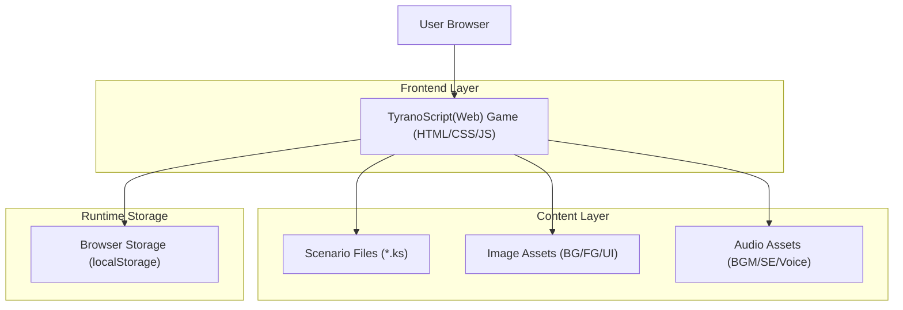

## 1.Architecture design

## 2.Technology Description
- Frontend: TyranoScript(Web)（HTML + JavaScript + CSS）
- Backend: None（静的ホスティングで完結）
- Data Storage: ブラウザ localStorage（セーブ/既読/永続変数）

## 3.Route definitions
| Route | Purpose |
|-------|---------|
| /Web/games/wedding-novel/index.html | タイトル表示、エピソード選択、ゲーム起動（TyranoScript起点） |

## 4.API definitions (If it includes backend services)
Backendを持たないため不要。

## 6.Data model(if applicable)
DBを持たないため不要。代わりに、localStorageへ「セーブスロット」「既読フラグ」「永続変数（sf）」を保存する。
